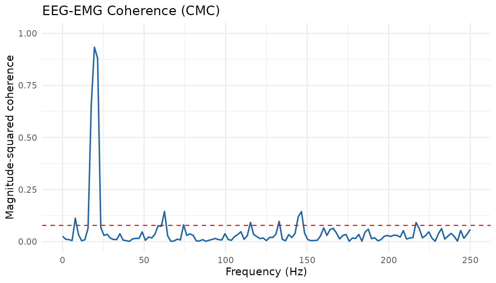
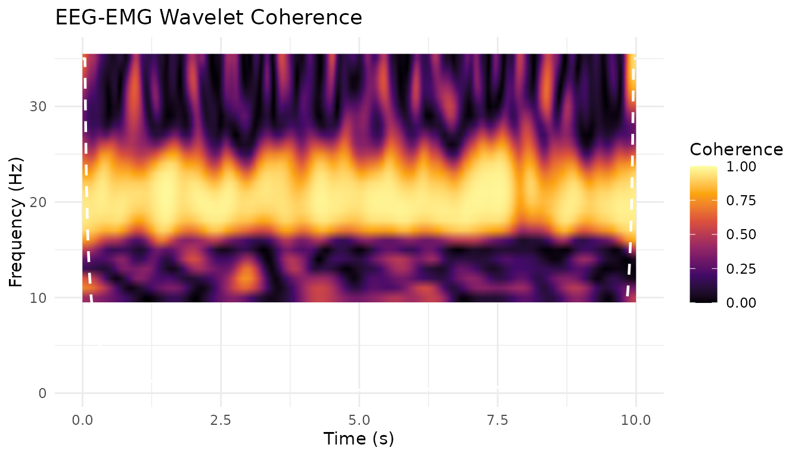
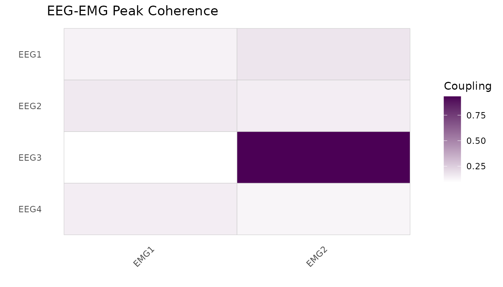

# Introduction to PhysioCrossModal

## Overview

**PhysioCrossModal** provides tools for analysing coupling,
connectivity, and synchrony *between* physiological signals of different
modalities. While single-modality analysis (e.g., EEG coherence between
channels) is handled by PhysioAnalysis, PhysioCrossModal focuses on the
relationship between distinct signal types – for example, quantifying
how cortical EEG activity drives peripheral EMG during a motor task.

The package introduces:

- **`MultiPhysioExperiment`** – a container that holds multiple
  `PhysioExperiment` objects recorded simultaneously at potentially
  different sampling rates.
- **Spectral coupling** – magnitude-squared coherence and cross-spectral
  density between modalities.
- **Phase synchrony** – Phase Locking Value (PLV), Phase Lag Index
  (PLI), and weighted PLI (wPLI).
- **Directed coupling** – time-domain and spectral Granger causality.
- **Time-domain coupling** – cross-correlation and sliding-window
  cross-correlation.
- A unified
  **[`couplingAnalysis()`](https://x-biosignal.github.io/PhysioCrossModal/reference/couplingAnalysis.md)**
  wrapper that dispatches to any of the above methods with a single
  function call.

This vignette walks through a cortico-muscular coherence (CMC) analysis
as a worked example – a common paradigm in motor neuroscience where the
goal is to quantify the functional coupling between cortical EEG and
peripheral EMG during sustained isometric contraction.

**References:** Mima & Hallett (1999), Halliday et al. (1995).

## Creating simulated EEG and EMG data

In a real experiment you would import data with `PhysioCore::readEDF()`
or similar I/O functions. Here we generate synthetic signals with a
known 20 Hz coupling (the beta-band CMC peak typically observed during
steady-force tasks).

**Note:** In real CMC research, coherence values are typically in the
range 0.1–0.4. We use a higher coupling strength here for pedagogical
clarity. Additionally, real EMG data should be rectified (full-wave
rectification) before CMC analysis.

``` r

library(PhysioCrossModal)
#> Loading required package: PhysioCore
#> Warning: replacing previous import 'S4Arrays::makeNindexFromArrayViewport' by
#> 'DelayedArray::makeNindexFromArrayViewport' when loading 'SummarizedExperiment'

set.seed(42)

# --- Parameters ---
sr_eeg <- 500          # EEG sampling rate (Hz)
sr_emg <- 1000         # EMG sampling rate (Hz)
n_sec  <- 10           # recording duration (seconds)
cmc_freq <- 20         # coupling frequency (Hz)
cmc_strength <- 0.7    # coupling strength (0 = none, 1 = perfect)

n_eeg <- as.integer(sr_eeg * n_sec)
n_emg <- as.integer(sr_emg * n_sec)
t_eeg <- seq(0, by = 1 / sr_eeg, length.out = n_eeg)
t_emg <- seq(0, by = 1 / sr_emg, length.out = n_emg)

# Shared 20 Hz oscillation (the "cortical drive")
driver_eeg <- sin(2 * pi * cmc_freq * t_eeg)
driver_emg <- sin(2 * pi * cmc_freq * t_emg)

# Four EEG channels -- only channel 1 carries the CMC signal
n_eeg_ch <- 4
eeg_data <- matrix(rnorm(n_eeg * n_eeg_ch), nrow = n_eeg, ncol = n_eeg_ch)
eeg_data[, 1] <- eeg_data[, 1] + cmc_strength * driver_eeg

# Two EMG channels -- only channel 1 carries the CMC signal
n_emg_ch <- 2
emg_data <- matrix(rnorm(n_emg * n_emg_ch) * 0.5, nrow = n_emg, ncol = n_emg_ch)
emg_data[, 1] <- emg_data[, 1] + cmc_strength * driver_emg
```

## Building PhysioExperiment objects

Each modality is stored as a standard `PhysioExperiment` from the
PhysioCore package. The key fields are the signal matrix (time x
channels), channel metadata in `colData`, and the sampling rate.

``` r

pe_eeg <- PhysioExperiment(
  assays   = list(raw = eeg_data),
  colData  = S4Vectors::DataFrame(
    label = paste0("EEG", seq_len(n_eeg_ch)),
    type  = rep("EEG", n_eeg_ch)
  ),
  samplingRate = sr_eeg
)

pe_emg <- PhysioExperiment(
  assays   = list(raw = emg_data),
  colData  = S4Vectors::DataFrame(
    label = paste0("EMG", seq_len(n_emg_ch)),
    type  = rep("EMG", n_emg_ch)
  ),
  samplingRate = sr_emg
)
```

## Creating a MultiPhysioExperiment

The `MultiPhysioExperiment` container bundles the two modalities
together with temporal alignment metadata. Note that the EEG and EMG
have different sampling rates (500 vs 1000 Hz) – the container preserves
both natively.

``` r

mpe <- MultiPhysioExperiment(EEG = pe_eeg, EMG = pe_emg)
mpe
#> class: MultiPhysioExperiment
#> modalities(2): EEG, EMG
#> samplingRates: EEG=500Hz, EMG=1000Hz
#>   EEG: 5000 timepoints x 4 channels
#>   EMG: 10000 timepoints x 2 channels
```

You can query the container:

``` r

modalities(mpe)        # "EEG" "EMG"
#> [1] "EEG" "EMG"
samplingRates(mpe)     # EEG=500 EMG=1000
#>  EEG  EMG 
#>  500 1000
nModalities(mpe)       # 2
#> [1] 2
```

## Spectral coherence (CMC)

The core analysis: magnitude-squared coherence between EEG channel 1 and
EMG channel 1. Coherence quantifies the linear frequency-domain
relationship and ranges from 0 (no coupling) to 1 (perfect coupling).

Both coherence (Welch’s method) and Granger causality assume weak
stationarity. For a 10-second sustained isometric contraction this is
plausible, but researchers working with dynamic tasks should verify this
assumption.

``` r

coh_result <- coherence(
  mpe,
  modality_x = "EEG",
  modality_y = "EMG",
  channels_x = 1L,
  channels_y = 1L,
  nperseg    = 256L
)

str(coh_result)
#> List of 5
#>  $ coherence       : num [1:129] 0.02535 0.01142 0.00946 0.00515 0.11206 ...
#>  $ type            : chr "magnitude"
#>  $ frequencies     : num [1:129] 0 1.95 3.91 5.86 7.81 ...
#>  $ confidence_limit: num 0.0778
#>  $ n_segments      : int 38

# Find the peak coherence near 20 Hz
peak_idx <- which.max(coh_result$coherence)
cat(sprintf("Peak coherence = %.3f at %.1f Hz\n",
            coh_result$coherence[peak_idx],
            coh_result$frequencies[peak_idx]))
#> Peak coherence = 0.933 at 19.5 Hz
```

The `confidence_limit` field provides a 95% significance threshold based
on the number of segments in the Welch estimation (Halliday et al.
1995). Coherence values above this line are unlikely to arise by chance.

You can restrict the output to a frequency range of interest:

``` r

coh_beta <- coherence(
  mpe,
  modality_x = "EEG",
  modality_y = "EMG",
  freq_range = c(13, 30)   # beta band
)
```

### Visualisation

``` r

plotCoherenceSpectrum(coh_result, title = "EEG-EMG Coherence (CMC)")
```



## Phase Locking Value (PLV)

PLV (Lachaux et al. 1999) measures the consistency of the phase
difference between two signals within a specified frequency band. A PLV
near 1 indicates that the two signals maintain a stable phase
relationship; a PLV near 0 indicates random phase differences.

``` r

plv_result <- phaseLockingValue(
  mpe,
  modality_x = "EEG",
  modality_y = "EMG",
  freq_band  = c(15, 25)   # beta band around 20 Hz
)

cat(sprintf("PLV = %.3f\n", plv_result$plv))
#> PLV = 0.954
```

## Granger causality

Granger causality (Granger 1969; Geweke 1982) quantifies *directed*
coupling – it tells you whether the past of signal X helps predict the
future of signal Y, beyond what Y’s own past can predict. This is
particularly relevant for CMC because cortico-muscular drive is thought
to be predominantly (though not exclusively) descending (EEG drives
EMG).

``` r

gc_result <- grangerCausality(
  mpe,
  modality_x = "EEG",
  modality_y = "EMG",
  order      = 10L        # AR model order
)

cat(sprintf("GC (EEG -> EMG) = %.4f\n", gc_result$gc_xy))
#> GC (EEG -> EMG) = 0.0181
cat(sprintf("GC (EMG -> EEG) = %.4f\n", gc_result$gc_yx))
#> GC (EMG -> EEG) = 0.0966
cat(sprintf("Net GC          = %.4f\n", gc_result$net_gc))
#> Net GC          = -0.0784
# Positive net_gc indicates EEG drives EMG more than the reverse
```

Note: for Granger causality to work correctly, both signals must be
resampled to the same rate. When you pass a `MultiPhysioExperiment`, the
internal signal extraction handles this automatically.

## The couplingAnalysis() wrapper

If you want a uniform interface to all coupling methods, use
[`couplingAnalysis()`](https://x-biosignal.github.io/PhysioCrossModal/reference/couplingAnalysis.md).
It dispatches to the appropriate function based on the `method`
argument:

``` r

# Coherence via wrapper
res_coh <- couplingAnalysis(
  mpe,
  modality_x = "EEG",
  modality_y = "EMG",
  method     = "coherence"
)

# Cross-correlation via wrapper
res_cc <- couplingAnalysis(
  mpe,
  modality_x = "EEG",
  modality_y = "EMG",
  method     = "crosscorrelation"
)
cat(sprintf("Peak cross-correlation = %.3f at lag = %d samples (%.1f ms)\n",
            res_cc$peak_correlation,
            res_cc$peak_lag,
            res_cc$peak_lag_seconds * 1000))
#> Peak cross-correlation = -0.381 at lag = 37 samples (74.0 ms)
```

The wrapper accepts the same `x`/`y` and `mpe` arguments as the
individual functions, plus `method`-specific parameters via `...`.

## Working with raw numeric vectors

All coupling functions also accept plain numeric vectors with an
explicit `sr` argument. This is useful for quick one-off analyses or
when your data is not yet stored in a PhysioExperiment:

``` r

set.seed(123)
sr <- 500
t <- seq(0, 10, length.out = sr * 10)
x <- sin(2 * pi * 20 * t) + 0.2 * rnorm(length(t))
y <- 0.8 * sin(2 * pi * 20 * t) + 0.2 * rnorm(length(t))

# Direct vector interface
coh <- coherence(x, y, sr = sr)
gc  <- grangerCausality(x, y, sr = sr, order = 10)
cc  <- crossCorrelation(x, y, sr = sr)
```

## Signal alignment utilities

When modalities have different sampling rates, you may need to resample
before certain analyses. PhysioCrossModal provides helper functions:

``` r

# Resample a single PE to a target rate
pe_emg_500 <- alignToRate(pe_emg, target_rate = 500)

# Align multiple PEs to the lowest rate and bundle into an MPE
mpe_aligned <- alignSignals(EEG = pe_eeg, EMG = pe_emg,
                            method = "lowest_rate")

# Merge two same-rate PEs into a single PE (column-bind)
merged_pe <- mergePhysio(pe_eeg, alignToRate(pe_emg, target_rate = 500),
                         prefix = c("EEG_", "EMG_"))
```

## Statistical significance testing

PhysioCrossModal v0.2.0 provides two complementary approaches for
assessing the statistical significance of coupling estimates:
surrogate-based null-hypothesis testing and block-bootstrap confidence
intervals.

### Surrogate testing

[`surrogateTest()`](https://x-biosignal.github.io/PhysioCrossModal/reference/surrogateTest.md)
generates a null distribution by randomising the phase spectrum (or
circularly shifting) one signal, thereby destroying the cross-signal
relationship while preserving autocorrelation:

``` r

surr <- surrogateTest(
  mpe,
  modality_x = "EEG",
  modality_y = "EMG",
  method     = "coherence",
  n_surrogates = 19,
  nperseg = 256L
)
cat(sprintf("Observed = %.3f, p = %.4f, 95%% threshold = %.3f\n",
            surr$statistic, surr$p_value, surr$threshold_95))
#> Observed = 0.933, p = 0.5500, 95% threshold = 0.940
```

### Bootstrap confidence intervals

[`bootstrapCI()`](https://x-biosignal.github.io/PhysioCrossModal/reference/bootstrapCI.md)
uses the moving-block bootstrap (preserving temporal autocorrelation) to
construct confidence intervals:

``` r

boot <- bootstrapCI(
  mpe,
  modality_x = "EEG",
  modality_y = "EMG",
  method     = "coherence",
  n_boot     = 19,
  ci         = 0.95,
  nperseg    = 256L
)
cat(sprintf("95%% CI: [%.3f, %.3f]\n", boot$ci_lower, boot$ci_upper))
#> 95% CI: [0.828, 0.900]
```

## Wavelet coherence

While Welch-based coherence gives a single frequency-domain estimate
averaged over the entire recording, wavelet coherence
([`waveletCoherence()`](https://x-biosignal.github.io/PhysioCrossModal/reference/waveletCoherence.md))
reveals *time-frequency* coupling dynamics. This is particularly useful
when coupling strength varies over time (e.g. during movement onset or
task transitions).

``` r

wcoh <- waveletCoherence(
  mpe,
  modality_x = "EEG",
  modality_y = "EMG",
  frequencies = seq(10, 35, by = 1),
  n_cycles = 7,
  smoothing_cycles = 3
)
# wcoh$coherence is a [time x frequency] matrix
# wcoh$phase contains the phase differences
# wcoh$coi contains the Cone of Influence frequencies

# Wavelet PLV is also available:
wplv <- waveletPLV(
  mpe,
  modality_x = "EEG",
  modality_y = "EMG",
  frequencies = seq(10, 35, by = 1)
)
```

### Wavelet coherence visualization

``` r

plotWaveletCoherence(wcoh, title = "EEG-EMG Wavelet Coherence")
```



## Multi-channel coupling matrices

When you want to compute coupling across all channel pairs (e.g., to
identify which EEG electrode shows the strongest coherence with which
EMG channel), use
[`coherenceMatrix()`](https://x-biosignal.github.io/PhysioCrossModal/reference/coherenceMatrix.md)
or the generic
[`couplingMatrix()`](https://x-biosignal.github.io/PhysioCrossModal/reference/couplingMatrix.md):

``` r

mat <- coherenceMatrix(
  mpe,
  modality_x = "EEG",
  modality_y = "EMG",
  nperseg    = 256L
)
# mat$matrix is a [n_eeg_channels x n_emg_channels] matrix

# Visualise as a heatmap
if (requireNamespace("ggplot2", quietly = TRUE)) {
  plotCouplingMatrix(mat$matrix, title = "EEG-EMG Peak Coherence")
}
```



The generic
[`couplingMatrix()`](https://x-biosignal.github.io/PhysioCrossModal/reference/couplingMatrix.md)
works with any coupling method:

``` r

cc_mat <- couplingMatrix(
  mpe,
  modality_x = "EEG",
  modality_y = "EMG",
  method = "crosscorrelation"
)
```

## Summary

| Method | Function | What it measures |
|----|----|----|
| Spectral coherence | [`coherence()`](https://x-biosignal.github.io/PhysioCrossModal/reference/coherence.md) | Linear frequency-domain coupling \[0, 1\] |
| Cross-spectral density | [`crossSpectrum()`](https://x-biosignal.github.io/PhysioCrossModal/reference/crossSpectrum.md) | Magnitude and phase of frequency coupling |
| Phase Locking Value | [`phaseLockingValue()`](https://x-biosignal.github.io/PhysioCrossModal/reference/phaseLockingValue.md) | Phase consistency in a frequency band \[0, 1\] |
| Phase Lag Index | [`phaseLagIndex()`](https://x-biosignal.github.io/PhysioCrossModal/reference/phaseLagIndex.md) | Phase coupling robust to volume conduction \[0, 1\] |
| Weighted PLI | [`weightedPLI()`](https://x-biosignal.github.io/PhysioCrossModal/reference/weightedPLI.md) | Noise-weighted phase coupling \[0, 1\] |
| Granger causality | [`grangerCausality()`](https://x-biosignal.github.io/PhysioCrossModal/reference/grangerCausality.md) | Directed (causal) coupling |
| Cross-correlation | [`crossCorrelation()`](https://x-biosignal.github.io/PhysioCrossModal/reference/crossCorrelation.md) | Time-domain coupling with lag estimation |
| Sliding cross-correlation | [`slidingCrossCorrelation()`](https://x-biosignal.github.io/PhysioCrossModal/reference/slidingCrossCorrelation.md) | Time-varying coupling dynamics |
| **Wavelet coherence** | [`waveletCoherence()`](https://x-biosignal.github.io/PhysioCrossModal/reference/waveletCoherence.md) | Time-frequency coherence via Morlet wavelets |
| **Wavelet PLV** | [`waveletPLV()`](https://x-biosignal.github.io/PhysioCrossModal/reference/waveletPLV.md) | Time-frequency phase locking |
| **Surrogate test** | [`surrogateTest()`](https://x-biosignal.github.io/PhysioCrossModal/reference/surrogateTest.md) | Null-hypothesis significance testing |
| **Bootstrap CI** | [`bootstrapCI()`](https://x-biosignal.github.io/PhysioCrossModal/reference/bootstrapCI.md) | Confidence intervals via block bootstrap |
| **Multitaper coherence** | [`multitaperCoherence()`](https://x-biosignal.github.io/PhysioCrossModal/reference/multitaperCoherence.md) | Coherence via DPSS tapers (low variance) |
| **Coherence matrix** | [`coherenceMatrix()`](https://x-biosignal.github.io/PhysioCrossModal/reference/coherenceMatrix.md) | Multi-channel coherence across all pairs |
| **Coupling matrix** | [`couplingMatrix()`](https://x-biosignal.github.io/PhysioCrossModal/reference/couplingMatrix.md) | Multi-channel coupling (any method) |
| **Matrix significance** | [`surrogateMatrixTest()`](https://x-biosignal.github.io/PhysioCrossModal/reference/surrogateMatrixTest.md) | Surrogate test with FDR correction |
| **Wavelet plot** | [`plotWaveletCoherence()`](https://x-biosignal.github.io/PhysioCrossModal/reference/plotWaveletCoherence.md) | Time-frequency heatmap with COI |
| Unified wrapper | [`couplingAnalysis()`](https://x-biosignal.github.io/PhysioCrossModal/reference/couplingAnalysis.md) | Dispatches to any of the above |

For further details on each function, see the package reference manual
([`?coherence`](https://x-biosignal.github.io/PhysioCrossModal/reference/coherence.md),
[`?phaseLockingValue`](https://x-biosignal.github.io/PhysioCrossModal/reference/phaseLockingValue.md),
etc.).
